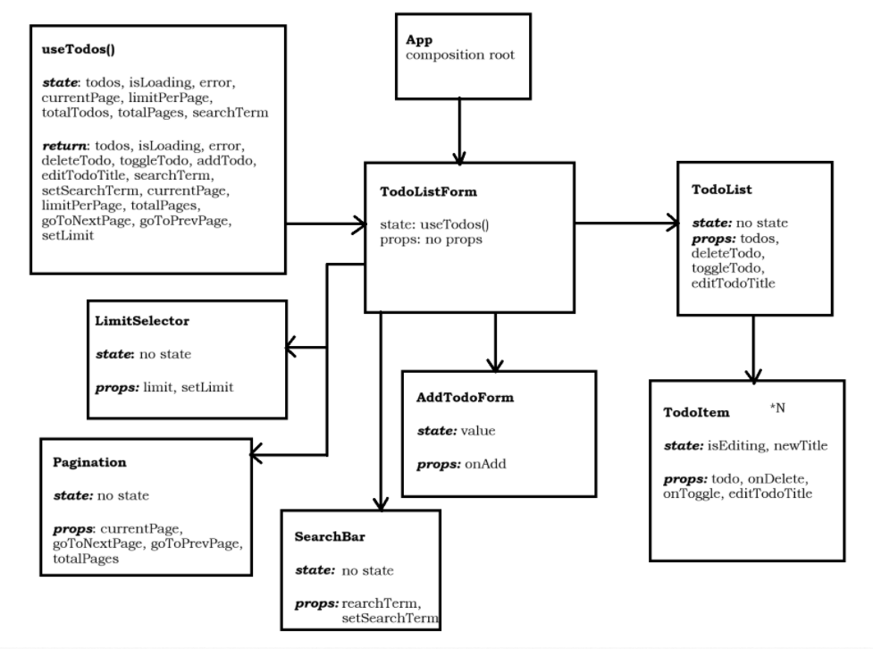

# React + Vite

This template provides a minimal setup to get React working in Vite with HMR and some ESLint rules.

Currently, two official plugins are available:

- [@vitejs/plugin-react](https://github.com/vitejs/vite-plugin-react/blob/main/packages/plugin-react) uses [Babel](https://babeljs.io/) for Fast Refresh
- [@vitejs/plugin-react-swc](https://github.com/vitejs/vite-plugin-react/blob/main/packages/plugin-react-swc) uses [SWC](https://swc.rs/) for Fast Refresh

## Component Tree

App

App acts as the composition root and doesn’t manage any own state.
It only renders the TodoListForm component, which coordinates the entire system.

TodoListForm

This component uses a custom hook useTodos() to manage all data, loading states, and pagination.
It passes the retrieved data and methods to child components (TodoList, AddTodoForm, SearchBar, Pagination, LimitSelector).

The useTodos() hook provides:
todos — the current list of tasks
isLoading / error — loading and error states
addTodo(title) — adds a new task
editTodoTitle(id, title) — edits a task title
toggleTodo(id) — toggles completion status
deleteTodo(id) — deletes a task
searchTerm, setSearchTerm — for searching
currentPage, goToNextPage, goToPrevPage, limitPerPage, setLimit, totalPages — for pagination

AddTodoForm

Responsible only for the local input field state.
Calls onAdd(title) to send the new task up to TodoListForm.

SearchBar

Handles only the search query, passed via props (searchTerm, setSearchTerm).
Does not contain any internal state.

TodoList

Receives todos and action callbacks (deleteTodo, toggleTodo, editTodoTitle).
Renders a list of TodoItem components.
Contains no logic — responsible only for display.

TodoItem

Represents a single task.
Has local state: isEditing (edit mode) and newTitle (temporary text while editing).
Calls the following callbacks:

onToggle(id) — toggles completion
onDelete(id) — deletes the task
editTodoTitle(id, title) — updates the task title

Pagination

Receives currentPage, totalPages, goToNextPage, and goToPrevPage.
Has no internal state — simply handles page navigation.

LimitSelector

Provides the ability to select the number of items per page (limit, setLimit).
Contains no internal state

## React Compiler

The React Compiler is currently not compatible with SWC. See [this issue](https://github.com/vitejs/vite-plugin-react/issues/428) for tracking the progress.

## Expanding the ESLint configuration

If you are developing a production application, we recommend using TypeScript with type-aware lint rules enabled. Check out the [TS template](https://github.com/vitejs/vite/tree/main/packages/create-vite/template-react-ts) for information on how to integrate TypeScript and [`typescript-eslint`](https://typescript-eslint.io) in your project.
