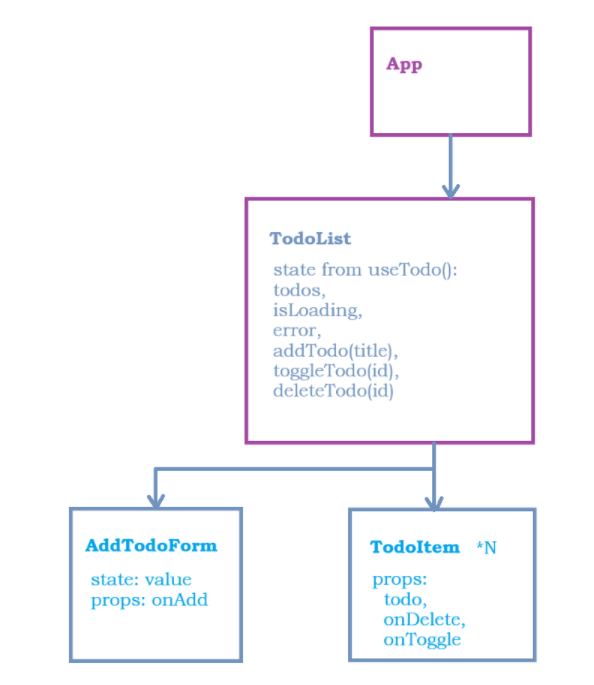

# React + Vite

This template provides a minimal setup to get React working in Vite with HMR and some ESLint rules.

Currently, two official plugins are available:

- [@vitejs/plugin-react](https://github.com/vitejs/vite-plugin-react/blob/main/packages/plugin-react) uses [Babel](https://babeljs.io/) for Fast Refresh
- [@vitejs/plugin-react-swc](https://github.com/vitejs/vite-plugin-react/blob/main/packages/plugin-react-swc) uses [SWC](https://swc.rs/) for Fast Refresh

## Component Tree

The App component acts only as a composition root and does not contain any state.

The TodoList component is responsible for fetching and managing all server-related todo state through the custom useTodos() hook. This hook provides:

todos – the current list of todo items
isLoading – whether data is being fetched or mutated
error – error message in case of failed API request
addTodo(title) – adds a new task
toggleTodo(id) – updates the completion status of a task
deleteTodo(id) – removes a task

The AddTodoForm handles only local input state and calls onAdd(title) to pass the new task upward to TodoList.

The TodoItem component receives a single todo object via props and exposes two callback actions:

onToggle(id) – requests completion toggle
onDelete(id) – requests deletion

The actual data mutation is performed in useTodos, ensuring a clear separation between UI (presentational components) and logic (custom hook).

## React Compiler

The React Compiler is currently not compatible with SWC. See [this issue](https://github.com/vitejs/vite-plugin-react/issues/428) for tracking the progress.

## Expanding the ESLint configuration

If you are developing a production application, we recommend using TypeScript with type-aware lint rules enabled. Check out the [TS template](https://github.com/vitejs/vite/tree/main/packages/create-vite/template-react-ts) for information on how to integrate TypeScript and [`typescript-eslint`](https://typescript-eslint.io) in your project.
